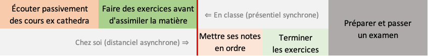

# Préambule {.unnumbered}

```{r setup, include=FALSE, cache=FALSE}
knitr::write_bib(c(.packages(), 'bookdown', 'knitr', 'rmarkdown'), 'packages.bib')
```

`r learnitdown::clean_ex_toc()` `r learnitdown::diagnose_login(lang = "fr")`

Cet ouvrage est conçu pour être utilisé de manière interactive en ligne. En effet, vous y trouverez des vidéos, des démonstrations interactives ainsi que des exercices sous forme de questionnaires interactifs. **Ces différents éléments ne sont, bien évidemment, utilisables qu'en ligne.**


------------------------------------------------------------------------

*Le matériel dans cet ouvrage est distribué sous licence [CC BY-NC-SA 4.0](https://creativecommons.org/licenses/by-nc-sa/4.0/deed.fr).*

------------------------------------------------------------------------

<details>

<summary>Informations système</summary>

```{r, class.source='hidden-code'}
sessioninfo::session_info()
```

</details>

## Vue générale des cours {.unnumbered}

Cet ouvrage interactif est le troisième volume d'une série de trois ouvrages traitant de la science des données biologiques. L'écriture de cette suite de livres a débuté au cours de l'année académique 2018-2019. Pour l'année académique 2023-2024, cet ouvrage interactif est le support des cours suivants :

-   [Science des données III : exploration et prédiction](http://applications.umons.ac.be/web/fr/pde/2023-2024/ue/US-M1-BIOL60-004-M.htm) aux premiers Masters BBMC (Biochimie, Biologie Moléculaire et Cellulaire) et BOE (Biologie des Organismes et Écologie) en Faculté des Sciences de l'Université de Mons, et dont le responsable est Philippe Grosjean

-   [Science des données III](https://www.ulb.be/fr/programme/binf-y402) aux premiers Masters BBMC (Biochimie, Biologie Moléculaire et Cellulaire) en Faculté des Sciences de l'Université Libre de Bruxelles sur le campus de Charleroi, et dont le responsable est Philippe Grosjean

-   [Science des données IV : recherche reproductible](http://applications.umons.ac.be/web/fr/pde/2023-2024/ue/US-M2-BIOEFA-015-M.htm) cours à option donné aux deuxièmes années des mêmes Masters, et dont le responsable est également Philippe Grosjean

La matière est divisée en six modules de 6h chacun en présentiel pour SDD III, et six modules également pour SDD IV. Chaque module nécessitera environ 8h (variable, en fonction de votre rythme et de votre technique d'apprentissage) de travail à domicile. **Cette matière fait suite aux deux premiers cours dont les contenus sont considérés comme assimilés (voir [cours SDD I](https://wp.sciviews.org/sdd-umons){target="top"} et [cours SDD II](https://wp.sciviews.org/sdd-umons2){target="top"}).**

### SDD III : exploration et prédiction {.unnumbered}

Les trois premiers modules de ce cours se concentrent sur les techniques de classification supervisée, encore appelées apprentissage machine (*machine learning* en anglais) qui prennent de plus en plus d'importance de nos jours dans tous les domaines, y compris la biologie. Ces techniques utilisent des algorithmes d'apprentissage à la base de l'intelligence artificielle et du "deep learning".

Ensuite, deux modules sont consacrés à des données particulières avec des dépendances temporelles (les séries dites "spatio-temporelles" ou chronologiques). L'étude de phénomènes qui évoluent dans le temps est courante en biologie, et l'analyse de telles données nécessite l'utilisation de techniques statistiques adaptées que nous aborderons dans cette partie.

Enfin, un dernier module est consacré à une initiation à l'analyse de données spatialisées et à la réalisation de cartes avec R. Ici aussi, il s'agit d'un aspect important pour beaucoup de biologistes, en particulier ceux qui travaillent sur le terrain.

### SDD IV : recherche reproductible {.unnumbered}

Ce cours à option vient terminer la formation en science de données biologiques en approfondissant la gestion du code et des projets et en s'intéressant à un "écosystème logiciel" plus large avec les bases de données et le calcul sur le cloud. Le premier module permet de se familiariser avec des données particulières comme les dates, les données circulaires et le texte (y compris les expressions régulières). Le second module vise à s'organiser pour gérer au mieux un gros projet. Les quatre modules suivants abordent successivement la modularisation du code, son optimisation et son test, la gestion de bases de données, et enfin, l'utilisation de packages R, de calcul en parallèle et sur le cloud. Un projet mettant en œuvre ces techniques plus avancées est également réalisé par les étudiants qui ont choisi de suivre ce cours.

## Matériel pédagogique {.unnumbered}

Le matériel pédagogique, rassemblé dans ce syllabus interactif, est aussi varié que possible. Vous pourrez ainsi piocher dans l'offre en fonction de vos envies et de votre profil d'apprenant pour optimiser votre travail. Vous trouverez :

-   le présent ouvrage en ligne,

-   des [exercices H5P](http://www.h5p.org) en ligne repérables par le logo [](https://wp.sciviews.org/h5p/){target="top"} sur lequel vous pouvez cliquer pour avoir plus d'infos sur leur utilisation,

-   des [applications Shiny](https://shiny.rstudio.com/) qui sont des véritables petits programmes avec interface Web écrits en R. Ils vous démontrent "en live" certains concepts. Ces applications doivent être lancées en cliquant sur l'image contenant le logo [](https://wp.sciviews.org/shiny_app/){target="top"} et elles doivent être quittées avec le bouton `Quit` ou `Quit & Save` si l'enregistrement est activé. N'oubliez pas de soumettre votre réponse avec le bouton `Submit`. Si le serveur distant est trop lent ou indisponible, il est aussi possible de lancer ces applications Shiny directement dans RStudio (voir le message en italique qui apparaît en dessous de l'application),

-   des [tutoriels interactifs learnr](https://rstudio.github.io/learnr/). Vous pourrez exécuter ces tutoriels directement sur votre ordinateur dans RStudio, et vous aurez alors accès à des pages Web réactives contenant des explications, des exercices et des quiz en ligne. Ces tutoriels sont repérables dans l'ouvrage via l'icône suivante [](https://wp.sciviews.org/tutorial/){target="top"},

-   des [dépôts GitHub Classroom](https://classroom.github.com/) dans la section [BioDataScience-Course](https://www.github.com/BioDataScience-Course) pour réaliser et documenter vos travaux personnels. Les liens vers ces dépôts sont repérables par l'icône GitHub [](https://wp.sciviews.org/github_assignation/){target="top"},

-   des renvois vers des documents externes en ligne, types vidéos [Youtube](https://www.youtube.com/) ou [Vimeo](https://vimeo.com/), des ouvrages en ligne en anglais ou en français, des blogs, des tutoriels, des questions sur des sites comme [Stackoverflow](https://stackoverflow.com/) ou issues des [mailing lists R](https://www.r-project.org/mail.html), de [Twitter](https://twitter.com/), ...

-   des diapositives de présentations distribuées via le dépôt [sdd_lessons sur BioDataScience-Course](https://github.com/BioDataScience-Course/sdd_lessonstree/2023-2024) viennent compléter le tout.

```{block, type='info'}

::: {.nocourse}
Tout ce matériel est accessible à partir du [site Web du cours](https://wp.sciviews.org){target='top'}, et du présent syllabus interactif.
:::

::: {.S-BIOG-025 .S-BIOG-077}
Tout ce matériel est accessible à partir du [site Web du cours](https://wp.sciviews.org){target='top'}, du présent syllabus interactif et de Moodle pour les étudiants de l'UMONS.

Les travaux personnels seront à réaliser une machine virtuelle préconfigurée, la **'SciViews Box'**, que nous installerons ensemble à la fin du premier module avec les étudiants possédant un ordinateur adapté.

Vous pourrez poser vos questions par mail à l'adresse [sdd@sciviews.org](mailto:sdd@sciviews.org) ou dans les issues du dépôt GitHub de ce cours. L'accès à ce dépôt vous sera donné lors du premier module du cours.

Un **outil d'annotation** et de surlignage est intégré dans le cours en ligne. Il vous permet\ :

- de personnaliser votre cours en écrivant dedans comme vous le feriez avec un syllabus papier (annotations privées... tout ce qui vous passe par la tête).

- d'échanger des informations complémentaires entre vous (par exemple, trucs et astuces supplémentaires, liens utiles, etc.) ou avec vos enseignants (passages moins clairs ou lacunes éventuelles). Soyez constructif dans vos commentaires publics. Nous tiendrons compte de vos remarques pour améliorer le cours pour les années suivantes.

Pour annoter ou surligner, vous sélectionnez du texte et vous cliquez sur l'un des deux boutons `Annotate` ou `Highlight` qui apparaissent. Vous devez vous créer un compte (gratuit) sur [hypothes.is](https://hypothes.is) auparavant. Vos annotations publiques sont à poster dans le groupe **BioDataScience-Course**. Vous devez [vous y abonner en cliquant sur ce lien](https://hypothes.is/groups/miAKPpWy/biodatascience-course) et ensuite sélectionner ce groupe dans la barre d'outils en haut du panneau d'annotation **avant d'ajouter vos commentaires, qu'ils soient personnels ou de groupe**. 
:::

```

## Approche pédagogique {.unnumbered}

Ce livre en ligne ainsi que tout le matériel pédagogique cité plus haut a été développé pour être employé en pédagogie active en classe inversée. On peut résumer cette approche en deux phases. Vous apprenez d'abord à la maison, nous appliquons *ensuite* en présentiel.

### Classe inversée & pédagogie active {.unnumbered}

Dans la plus grande partie de vos cours, vous avez suivi **passivement** un cours *ex cathedra* suivi par une séance d'exercice ou de travaux pratiques.

On peut schématiser ce mode d'apprentissage comme cela



À la fin, un examen est indispensable pour valider l'acquisition des concepts.

Les cours de science des données utilisent une autre approche et se donnent en classe inversée. Le schéma ci-dessous vous propose l'organisation d'un module du cours. Vous devrez donc préparer en distanciel chaque session de cours en présentiel. Lors de chaque heure de travail lié à ce cours, vous serez donc **actif**.


### Quatre niveaux d'exercices {.unnumbered}

Quatre niveaux d'exercices de difficultés croissantes vous seront proposés.

-   niveau I : découverte des notions dans des exercices rapides et ciblés intégrés au sein du cours en ligne.
-   niveau II : appliquer les notions vues dans des exercices sous la forme de tutoriel très cadré
-   niveau III : transférer les notions dans des projets individuels guidés sur des données biologiques
-   niveau IV : Créer/réaliser des analyses sur des projets de groupe libre sur des données biologiques nouvelles grâce aux notions vues

Chaque type d'exercice est associé à un outil présenté dans le matériel pédagogique.


Toutes vos réponses sont collectées et utilisées afin de construire la note finale. Il n'est donc plus nécessaire de passer un examen classique en session d'examen. Tous ces exercices prouvent que vous avez acquis ou non les acquis d'apprentissage de ce cours.

Votre progression au sein des exercices de chaque module est mise à votre disposition à la fin de chaque module ou bien depuis Moodle.

```{block, type='warning'}
Les notes des exercices plus faciles de niveau 1, 2 et 3 sont comptabilisées séparément des exercices plus difficiles de niveau 4, des challenges et des interrogations, avec une pondération également en faveur de ces derniers. **Votre objectif est donc de bien vous préparer et de réussir vos projets, challenges et interrogations en présentiel.** Les exercices faciles vous aident à bien vous préparer. **Faites les sérieusement, c'est dans votre intérêt.**

L'évaluation est **continue** tout au long de l'année. Il n'y a pas d'examen en fin d'année et il n'y a pas moyen non plus de repasser un examen en seconde session. La présence aux séances est **obligatoire** pour cette raison et toute absence injustifiée vous coûtera un zéro pour la matière concernée.
```

### Plan du cours {.unnumbered}

Le plan du cours est une forme de contrat entre l'étudiant et les encadrants. Ce document structure les attentes de vos encadrants. Veuillez consulter ce document attentivement.

-   [Plan du cours de Science des données biologiques III : années 2023-2024](https://github.com/BioDataScience-Course/BioDataScience-Common/tree/2023-2024/docs/plan_de_cours/sdd3_plan_cours_2023-2024.pdf)

## Issues {#issues .unnumbered}

Toutes les questions relatives aux exercices sont à poser dans les issues GitHub dédiées à ces cours.

```{r  assign_C00Ga_issues, echo=FALSE, results='asis'}
if (exists("assignment2"))
  assignment2("C00Ga_issues", part = NULL, clone = FALSE,
    url = "https://github.com/BioDataScience-Course/sdd_issues",
    course.ids = c(
      'S-BIOG-025'         = !"C00Ga_{YY}M_issues"),
    course.urls = c(
      'S-BIOG-025'         = "https://classroom.github.com/a/jeU2Nmo2"),
    course.ends = c(
      'S-BIOG-025'         = !"{W[15]+5} 23:59:59"),
    term = "", level = 0,
    toc = "Poser ses questions dans une issue.", n = 100,
    texts = learnitdown::assignment2_fr(
      title = "Pour SDD III, rejoignez le projet",
      course = "[Projet GitHub Classroom d\u00e9di\u00e9e aux issues pour les \u00e9tudiants inscrits au cours de {course_name}]({course_url}){{target=\"_blank\"}}", 
      alt = "Les issues ne sont pas accessibles aux \u00e9tudiants externes."))
```

```{r  assign_D00Ga_issues, echo=FALSE, results='asis'}
if (exists("assignment2"))
  assignment2("D00Ga_issues", part = NULL, clone = FALSE,
    url = "https://github.com/BioDataScience-Course/sdd_issues",
    course.ids = c(
      'S-BIOG-077'         = !"D00Ga_{YY}C_issues"),
    course.urls = c(
      'S-BIOG-077'         = "https://classroom.github.com/a/z8glofPk"),
    course.ends = c(
      'S-BIOG-025'         = !"{W[15]+5} 23:59:59",
      'S-BIOG-077'         = !"{W[15]+5} 23:59:59"),
    term = "", level = 0,
    toc = "Poser ses questions dans une issue.", n = 100,
    texts = learnitdown::assignment2_fr(
      title = "Pour SDD IV, rejoignez le projet",
      course = "[Projet GitHub Classroom d\u00e9di\u00e9e aux issues pour les \u00e9tudiants inscrits au cours de {course_name}]({course_url}){{target=\"_blank\"}}", 
      alt = "Les issues ne sont pas accessibles aux \u00e9tudiants externes."))
```

*Note : vos enseignants sont également accessibles par mail via [sdd\@sciviews.org](mailto:sdd@sciviews.org){.email}, mais uniquement si vos questions nécessitent un échange en privé, sinon, vous devez utiliser les issues.*

Une fois que vous avez rejoint l'équipe **`r !"C{YY}"`** ou **`r !"D{YY}"`**, il n'est plus nécessaire d'utiliser le lien GitHub Classroom vers ces issues. Vous pouvez retrouver directement les issues liées à ce dépôt via la bannière du site.


Vous pouvez aussi directement créer une issue depuis RStudio. Voyez le fichier README.md dans le dépôt des issues pour les explications.

## Planning des séances {#temps .unnumbered}

| Module            | Préparation pour le ... | Fin N1-3         | Projet N4            | Challenge            | Interrogation        |
|------------|------------|------------|------------|------------|------------|
| *(install party)* | `r !"{W[4]+1}"`         |                  |                      |                      |                      |
| 1 Classif. I      | `r !"{W[5]+1}"`         | `r !"{W[6]+1}"`  |                      |                      |                      |
| 2 Classif. II     | `r !"{W[7]+1}"`         | `r !"{W[8]+1}"`  |                      |                      | **`r !"{W[7]+5}"`**  |
| 3 Classif. III    | `r !"{W[9]+1}"`         | `r !"{W[10]+1}"` |                      | **`r !"{W[9]+3}"`** |                      |
| 4 Chrono. I       | `r !"{W[11]+1}"`        | `r !"{W[12]+1}"` |                      |                      |                      |
| 5 Chrono. II      | `r !"{W[13]+1}"`        | `r !"{W[14]+1}"` |                      |                      | **`r !"{W[13]+5}"`** |
| 6 Spatial         | `r !"{W[15]+1}"`        | `r !"{W[15]+5}"` | **`r !"{W[15]+1}"`** |                      |                      |

: Dates importantes pour les activités de science des données biologiques III (à 23:59:59 pour les fins de projets N3 ou N4, à l'heure de la séance en présentiel pour les autres dates).

-   La colonne **préparation pour le...** indique la date pour laquelle vous devez avoir préparé[^index-1] la *totalité* du chapitre correspondant du cours en ligne, y compris les exercices de niveaux 1 et 2 (H5P, learnr, shiny).

-   Les **projets individuels** **de niveau 3** sont réalisés en présentiel. Vous ne pourrez les compléter efficacement que si vous avez bien préparé la matière. La date indiquée dans cette colonne correspond à la clôture des projets. Logiquement, vous devez avoir aussi terminé les exercices de niveaux 1 et 2 à ce moment-là.

-   Les **projets de groupe** **de niveau 4** se font sur une plus longue durée et à cheval sur plusieurs modules. Étalez et répartissez le travail entre vous. Prévoyez le temps nécessaire pour *terminer* vos rapports avant la date de fin.

-   Les **challenges** sont des exercices qui se font obligatoirement en séance sous forme de jeux, type compétition entre vous ou contre la montre. *Ils nécessitent d'être au point dans la manipulation du logiciel pour l'analyse de données biologiques en pratique.*

-   Les **interrogations** sont des contrôles classiques en présentiel sur feuille de papier ou sur ordinateur et limités à 30, 45 ou 60 minutes. *Réussir implique que vous ayez assimilé toute la matière vue jusque là.* Prévoyez entre une demi et une journée et demi pour la révision avant cette date, selon votre rythme de travail.

[^index-1]: Préparer la matière en classe inversée signifie que vous avez **étudié** ce que vous comprenez par vous-même et que vous avez **noté** vos questions relatives à ce que vous ne comprenez pas pour les poser en séance. Il ne s'agit pas *juste* de lire de manière distraite le syllabus !

*Notez les dates clés dans vos agendas. Les informations ci-dessus sont données à titre indicatif pour vous permettre de plannifier votre travail. Elles pourraient toutefois légèrement évoluer au cours de l'année académique en fonction des impondérables.*

Pour le cours de science des données biologiques IV, le travail se fait sur base de co-construction de savoir. Le planning est plus souple et défini de commun accord avec les étudiants qui se sont inscrit à cette UE.
